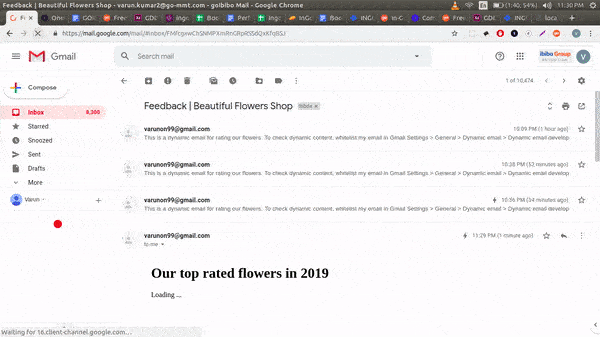
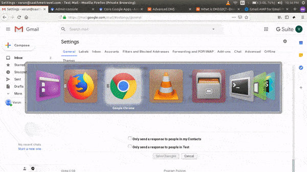

# amp4email aka ⚡4email

Recently Google rolled out amp4email support in Gmail. This tutorial provides a step by step guide on how to send dynamic email to end users.

### What is dynamic email?

**Official documentation**: The AMPHTML Email format provides a subset of AMP components that you can use in email messages. Recipients of AMP emails can view and interact with the AMP components directly in the email.

In layman's term this means that you can send interactive email with real-time dynamic content, e.g. you can make your users fill a form and save response right in their inbox without clicking on any link.

## Lets get started

### Step 1: Setting up this project

1. Clone/Download this repo- `git clone https://github.com/varunon9/amp4email.git`
2. Install dependencies `yarn install`
3. Create `config.js` file from `configStructure.js` file or just rename it to `config.js`

### Step 2: Configure sender details

1. Edit your gmail accoint details in `config.js` file (created in step 1)
2. Make sure that you have enabled less secure settings to your gmail account details (you can disable it after testing)
3. Visit https://myaccount.google.com/lesssecureapps?utm_source=google-account&utm_medium=web for enabling less secure apps settings

### Step3: Enabling dynamic email on receiver's gmail account

1. You must enable dynamic email settings on receiver's gmail account.
2. Whitelist your (sender) gmail account in receiver's Gmail Settings > General > Dynamic email > Dynamic email development

### Step4: Run the application

1. `yarn start`
2. Enter following url to browser `http://localhost:3500/send/?email=<your@email.com>`
3. `your@email.com` should get one dynamic email

### Complete Youtube demo

Please visit https://youtu.be/1SMjRAOlLl4

### Dynamic email received

## What's next?

This was simple POC for dynamic email using [nodemailer](https://github.com/nodemailer/nodemailer) v6.1.0. In your production environment you might want to perform these steps-

1. Configure your email notification engine to have support for dynamic email. Basically you need to add a new MIME part with a content type of `text/x-amp-html` as a descendant of `multipart/alternative`. It should live alongside the existing `text/html` or `text/plain` parts. Refer: https://www.ampproject.org/docs/interaction_dynamic/amp-email-format

2. Construct valid amp4email document to send in email. You can use https://amp.gmail.dev/playground/ to validate it. To test dynamic email from this playground, you need to whitelist  `amp@gmail.dev` in *Gmail Settings > General > Dynamic email > Dynamic email development*. Alternatively you can whitelist one of your own production email e.g. `info@example.com` and test it.

3. If you use free gmail accounts, you might have to wait for dynamic email settings to be available in your Gmail settings because Gmail is gradually rolling out this feature. If you organisation use G-Suite then your admin can enable these settings from `Apps > G Suite > Settings for Gmail > User Settings`

4. Once you test dynamic email, next step would be sending it to end users. For that you need to whitelist your domain to Google. You will have to send a real world dynamic email to `ampforemail.whitelisting@gmail.com` meeting all the guidelines. Refer: https://developers.google.com/gmail/ampemail/register
